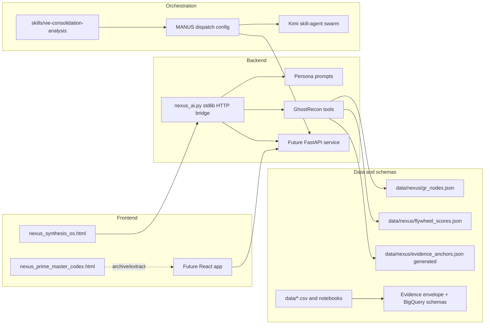

# Klein-Team ADR Platform: Repo Consolidation Audit, MANUS Routing, and Fable 5 Deployment Strategy

_Date: 2026-06-12_

## Scope and guardrails

- This is a technical infrastructure audit and roadmap only. It intentionally does not generate or analyze litigation strategy, legal theories, merits, or privileged work product.
- The local workspace audited is `/workspace/FinancialModeling_Project` on branch `work`. Public GitHub visibility was reviewed through GitHub's web repository listing for `jwk2588`; authenticated, private, and organization-wide inventory still requires user-provided access.
- The Fable 5 assessment is independently verified against Anthropic's public announcement and product/API pages available on 2026-06-12:
  - <https://www.anthropic.com/news/claude-fable-5-mythos-5>
  - <https://www.anthropic.com/claude/fable>
  - <https://www.anthropic.com/claude/mythos>
  - <https://platform.claude.com/docs/es/about-claude/models/introducing-claude-fable-5-and-claude-mythos-5>

## 1. Repo audit table

### 1.1 Current local repo inventory

| Repository / source | Last observed commit or update | Primary language / stack | One-line purpose | Consolidation status |
| --- | ---: | --- | --- | --- |
| `FinancialModeling_Project` local checkout | Commit `c5ac095`, 2026-06-05 16:20:33 -05:00 | Python, Jupyter Notebook, static HTML, CSV/XLSX/PDF assets | Financial modeling pipeline plus NEXUS static dashboard and AI bridge experiments. | Treat as an active prototype and source donor, not yet canonical production repo. |
| `main.py` + `scripts/` | Same repo commit | Python, pandas, yfinance, openpyxl | Ingests financial data, preprocesses statements, and generates baseline values. | Keep as `apps/financial-modeling` or `packages/financial-pipeline` after tests are added. |
| `nexus_ai.py` | Same repo commit | Python, Anthropic SDK, Google GenAI SDK, stdlib HTTP server | Local NEXUS AI bridge with personas, GhostRecon tool loop, state endpoints, and ingest flow. | Candidate backend seed, but should be split into FastAPI service modules before production. |
| `nexus_synthesis_os.html` | Same repo commit | Static HTML/CSS/JS | NEXUS v8 Synthesis OS dashboard shell with left navigation, status pills, GhostRecon/FW/SIM views, and local API bridge hooks. | Highest-value frontend consolidation target; convert to React components. |
| `nexus_prime_master_codex.html` | Same repo commit | Static HTML/CSS/JS | Lightweight master codex/index page for NEXUS file sections. | Merge into docs/dev-console or archive after extracting useful index metadata. |
| `data/nexus/*.json` | Same repo commit | JSON | GhostRecon nodes and flywheel scores consumed by `nexus_ai.py` and dashboard. | Move to `data/dev-fixtures` until a formal schema and access tier exist. |
| `skills/vie-consolidation-analysis` | Same repo commit | Codex/Claude-style skill scaffold | Example/research skill scaffold with scripts, references, and templates. | Archive or migrate to `tools/skills/` only if still used by MANUS routing. |
| `Apple/` and root Excel/PDF assets | Same repo commit | XLSX/PDF | Apple valuation workbook and a PDF exhibit-like artifact. | Move large/binary and privileged-adjacent files into controlled storage; keep only test fixtures if cleared. |

### 1.2 Public `jwk2588` repos visible from GitHub web listing

GitHub reported 54 public repositories for `jwk2588`, but the unauthenticated web page exposed only the first page before dynamic loading errors. The list below is therefore a partial public inventory, not a complete account/org audit.

| Repo | Last public update shown | Primary language / stack | Purpose summary | Overlap / action |
| --- | ---: | --- | --- | --- |
| `jwk2588/skrub` | 2026-06-08 | Python | Fork of dataframe ML tooling. | External fork; exclude from NEXUS consolidation unless custom commits exist. |
| `jwk2588/FinancialModeling_Project` | 2026-06-05 | Jupyter Notebook / Python | Public template matching this local repo's stated financial forecasting purpose. | Active source donor; compare local branch to GitHub before canonical import. |
| `jwk2588/sentry-mcp` | 2026-06-05 | TypeScript | Fork of Sentry MCP server. | Potential observability integration; do not merge code unless MANUS needs Sentry tooling. |
| `jwk2588/superset` | 2026-06-04 | TypeScript / Python | Fork of Apache Superset. | Dashboard/data exploration reference only; too large to merge into NEXUS. |
| `jwk2588/mc-agent-toolkit` | 2026-06-04 | Python | Monte Carlo agent observability toolkit fork. | Candidate integration reference for data quality/agent health; keep separate. |
| `jwk2588/google-cloud-python` | 2026-06-04 | Python | Fork of Google Cloud client libraries. | External fork; exclude. |
| `jwk2588/node` | 2026-06-03 | JavaScript/C++ | Fork of Node.js runtime. | External fork; exclude. |
| `jwk2588/h1domains` | 2026-06-02 | Python | Fork of HackerOne in-scope domains list. | Security-adjacent; keep out of general Fable route due safety rerouting risk. |
| `jwk2588/gitleaks-action` | 2026-06-01 | JavaScript | Fork of secret scanning GitHub Action. | Useful as CI reference; prefer upstream action in canonical repo. |
| `jwk2588/gitleaks` | 2026-06-01 | Go | Fork of secret scanner. | Use upstream binary/action; do not merge source. |
| `jwk2588/context7` | 2026-06-01 | TypeScript | Fork of docs/context platform. | Potential MCP/docs reference; keep separate. |
| `jwk2588/vscode-mermaid-chart` | 2026-06-01 | TypeScript | Fork of VS Code Mermaid Chart extension. | Diagram tooling reference only. |
| `jwk2588/adk-samples` | 2026-06-01 | Python | Fork of Google ADK samples. | Agent-pattern reference only. |
| `jwk2588/cloudflare-docs` | 2026-05-31 | MDX | Fork of Cloudflare docs. | External fork; exclude. |
| `jwk2588/vscode` | 2026-05-29 | TypeScript | Fork of VS Code. | External fork; exclude. |
| `jwk2588/pre-commit` | 2026-05-29 | Python | Fork of pre-commit framework. | Use upstream package; do not merge source. |
| `jwk2588/documentation` | 2026-05-29 | MDX | Fork of npm docs. | External fork; exclude. |
| `jwk2588/mistral-vibe` | 2026-05-29 | Python | Fork of Mistral coding CLI. | Agent harness reference only. |
| `jwk2588/client-python` | 2026-05-29 | Python | Fork of Mistral API client. | External fork; exclude. |
| `jwk2588/draftkings-data-nexus-codex` | 2026-05-29 | Python | DraftKings Evidentiary Cognition Engine with Neo4j, GraphRAG, Claude layer, and ETL. | Likely NEXUS-adjacent; needs authenticated clone/audit and privilege screening. |
| `jwk2588/AI-Agents-Projects-Tutorials` | 2026-05-28 | Jupyter Notebook | Fork of multi-agent tutorial material. | Reference only. |
| `jwk2588/cli` | 2026-05-27 | Go | Fork of GitHub CLI. | External fork; exclude. |
| `jwk2588/gcsfuse` | 2026-05-27 | Go | Fork of Google Cloud Storage FUSE. | External fork; exclude. |
| `jwk2588/sphinx` | 2026-05-24 | Python | Fork of Sphinx docs generator. | External fork; exclude. |
| `jwk2588/google-analytics-mcp` | 2026-05-21 | Python | Fork of Google Analytics MCP. | Optional analytics connector; keep separate. |
| `jwk2588/lakeFS.djt` | 2026-05-21 | Go | Fork of lakeFS data versioning. | Useful architectural reference for data lineage; keep separate. |
| `jwk2588/nexus-masterdb-hub` | 2026-05-20 | Python | NEXUS MasterDB communication hub and multi-platform agent/subagent ecosystem. | High-priority NEXUS-adjacent repo; likely canonical-or-peer candidate. |
| `jwk2588/antigravity-sdk-python` | 2026-05-20 | Python | Fork of Google Antigravity SDK. | Agent SDK reference only. |
| `jwk2588/DJT_GPT` | 2026-05-19 | Not shown | DK-related repository. | Needs clone and privilege review before any consolidation. |
| `jwk2588/express-js-on-vercel` | 2026-05-19 | TypeScript | Express/Vercel app scaffold. | Possible abandoned scaffold; compare with NEXUS frontend/backend needs. |

### 1.3 Inventory gaps to close before a real multi-repo consolidation

1. Authenticate to GitHub and export all repositories across `jwk2588`, all DJT-named accounts/orgs, and any private organizations.
2. For each candidate repo, capture default branch, last commit date, language breakdown, fork status, size, license, secrets scan result, and whether it contains privileged/FRE 408 or other restricted content.
3. Clone only the short list of NEXUS-adjacent repos first: `FinancialModeling_Project`, `draftkings-data-nexus-codex`, `nexus-masterdb-hub`, `DJT_GPT`, and any `nexus-*`/`ghost-recon-*` repositories not visible on the public page.

## 2. Overlap and dependency map

### 2.1 Overlap detection

| Cluster | Evidence | Recommendation |
| --- | --- | --- |
| Static NEXUS dashboards | The current repo contains `nexus_synthesis_os.html` and `nexus_prime_master_codex.html`; the user's prompt references additional `nexus-*.html` and Ghost Recon variants likely outside this checkout. | Consolidate dashboard variants into a React app with route-level feature flags. Preserve original HTML files in `archive/imports/<repo>/<sha>/` until parity tests exist. |
| AI bridge / conductor | `nexus_ai.py` embeds personas, tool schemas, local HTTP serving, state mutation, ingestion, Anthropic, and Gemini in one file. Public repos include `nexus-masterdb-hub` and `draftkings-data-nexus-codex`, likely overlapping orchestration/data roles. | Split into `apps/api` FastAPI endpoints, `packages/agents`, `packages/schemas`, and `packages/connectors`; designate MANUS config as the single router. |
| Financial modeling pipeline | `main.py` and `scripts/` are a coherent Python pipeline but lack formal tests and packaging. | Keep as a separate app/package in the monorepo; do not entangle with legal/corpus data. |
| Data fixtures / evidence-like state | `data/nexus/gr_nodes.json`, `flywheel_scores.json`, and generated CSV outputs are stored in-repo. | Create schema-validated fixtures and an access-controlled data boundary; production evidence/corpus data should not live in the public app repo. |
| Agent skill scaffolds | `skills/vie-consolidation-analysis` resembles an agent/plugin prototype. | Move generic, non-privileged skills to `tools/skills`; keep legal/corpus-specific skills in a private, access-controlled repo. |
| External forks | Many visible `jwk2588` repos are upstream forks of large external projects. | Do not consolidate source. Track only as dependencies, references, or GitHub Actions integrations. |

### 2.2 NEXUS dependency/integration map



## 3. Consolidation recommendation

### 3.1 Recommended canonical structure

Use a monorepo for the NEXUS technical platform and keep privileged/legal corpus material in a separate private data repo or object store. The repo boundary should enforce that Codex works on code, schemas, tests, and non-privileged fixtures only.

```text
nexus-platform/
  apps/
    web/                  # React replacement for nexus-*.html variants
    api/                  # FastAPI service replacing nexus_ai.py HTTP server
    financial-modeling/   # current main.py/scripts pipeline after packaging
  packages/
    agents/               # provider clients, personas as config, tool adapters
    schemas/              # evidence envelope, C-01--C-12 ingestion contracts, BigQuery schemas
    ui/                   # shared React components and Ghost Recon visualization modules
    data-connectors/      # BigQuery, Neo4j, Monte Carlo, GitHub, MCP connectors
  config/
    manus_dispatch.schema.json
    manus_dispatch.example.json
  data/
    dev-fixtures/         # sanitized JSON/CSV fixtures only
    id-ledger/            # append-only EV-/SB- ledger stubs, no privileged payloads
  docs/
    adr/                  # architecture decision records
    imports/              # import manifests, repo maps, migration logs
  tools/
    migration/            # history-preserving import scripts
    validation/           # deterministic validators and CI checks
```

### 3.2 History preservation plan

1. Create a clean canonical repo with no privileged payloads.
2. Import each source repo with `git subtree add --prefix archive/imports/<repo> <remote> <branch>` or `git filter-repo --to-subdirectory-filter` in a staging clone.
3. After import, move active code into canonical paths via normal commits so prior history remains reachable.
4. For restricted artifacts, commit only manifests/hashes and store actual content in private storage.
5. Add CI gates for secret scanning, schema validation, type checks, tests, and ID-ledger no-renumbering.

## 4. MANUS-as-conductor architecture

### 4.1 Sequence diagram

```mermaid
sequenceDiagram
  autonumber
  participant U as User / Cloud Computer
  participant M as MANUS conductor
  participant GH as GitHub source of truth
  participant C as Codex
  participant F as Claude Fable 5
  participant O as Claude Opus 4.8 / Sonnet 4.6
  participant K as Kimi skill-agent swarm
  participant P as Python deterministic jobs
  participant R as Review gates

  U->>M: Submit task with scope, budget, corpus tier, and deliverable
  M->>GH: Read repo state, issue context, schemas, ID ledger
  M->>M: Classify task type and risk
  alt Code maintenance, FastAPI, React, schema validators
    M->>C: Dispatch bounded PR task
    C->>GH: Branch, edit, test, commit, PR
  else Multi-day migration or screenshot/PDF-heavy UI reconstruction
    M->>F: Dispatch via Claude Code/Managed Agents harness
    F->>GH: Produce branch or patchset with migration log
  else High-stakes review or Fable safety fallback
    M->>O: Dispatch planning/review/fallback task
    O-->>M: Review memo or fallback answer
  else Non-privileged requirement extraction/checklists
    M->>K: Dispatch specialist skill-agent tasks
    K-->>M: Structured requirements/checklist artifacts
  else Quantitative/Monte Carlo/data transforms
    M->>P: Run deterministic scripts and validators
    P-->>M: Reproducible artifacts and logs
  end
  M->>R: Enforce tests, privilege boundary, and EV-/SB- ID policy
  R->>GH: Merge approved PR only; append IDs without reuse or renumbering
  GH-->>U: Versioned result, audit trail, and next-action queue
```

### 4.2 Minimal config schema

The standalone schema is committed at `config/manus_dispatch.schema.json`, with a runnable example at `config/manus_dispatch.example.json`. Core principles:

- GitHub is the only write-back source of truth.
- Routing targets include Codex, Claude Sonnet, Claude Opus, Claude Fable, Kimi swarm, and deterministic Python jobs.
- Fable is an escalation target, not a default target.
- Write-back is pull-request-only.
- EV-/SB-style IDs are additive-only: never renumber, never reuse, and append to a ledger.

## 5. Fable 5 deployment recommendation

### 5.1 Verified capabilities and constraints

Anthropic's June 9, 2026 materials state that Claude Fable 5 is the generally available Mythos-class model, shares an underlying model with Mythos 5, and is positioned above Opus-class models for difficult long-horizon reasoning and agentic work. Public materials specifically describe:

- API availability under model ID `claude-fable-5`.
- Pricing of $10 per million input tokens and $50 per million output tokens.
- 1M-token context and up to 128k output tokens per request in Anthropic's API docs.
- Intended use through an agent harness such as Claude Code or Claude Managed Agents for multi-day work.
- Strong coding, long-running autonomy, memory/long-context, and vision performance.
- Additional safety classifiers for cybersecurity, biology, and chemistry; the Mythos page says queries in those domains are routed to Opus 4.8 for Fable.
- Model-specific retention constraints in the API docs: Fable/Mythos are listed as covered models with 30-day retention and not zero-data-retention eligible.

### 5.2 Objective routing recommendation

**Partially adopt Fable 5 as a routing target.** It should be added to MANUS, but only as an explicit escalation route with budget, retention, and review gates.

| Workflow | Recommendation | Rationale |
| --- | --- | --- |
| Multi-day autonomous repo consolidation/migration | Use Fable 5 only after a repo inventory and migration manifest exist. | This is exactly the class of long-horizon, multi-stage coding work Fable is marketed for, but it is too expensive and too autonomous for first-pass discovery under a $100 Codex constraint. Start with Codex-generated manifests and small PRs; escalate only large history-preserving migrations. |
| Vision-based analysis of NEXUS screenshots, Ghost Recon node visualizations, charts/tables in exhibits | Use Fable 5 for screenshot-to-component reconstruction and chart/table extraction from non-privileged artifacts. | Fable's vision positioning is directly relevant. Keep privileged/legal exhibit interpretation out of the route; limit to UI parity, data extraction, and schema mapping. |
| Manus-as-conductor routing logic | Add `claude_fable` target, but do not make it the conductor. | MANUS should remain the policy/budget/source-of-truth layer. Fable is a powerful worker for large autonomous jobs, not the routing authority. |
| Sonnet 4.6 / Opus 4.8 comparison | Keep Sonnet for routine planning/summarization; Opus for review/fallback; Fable for long-horizon autonomy/vision-heavy builds. | This preserves cost discipline and reduces unnecessary exposure to Fable's retention/safety behavior. |
| Codex comparison | Codex remains the default code PR agent for this repo. | The current immediate tasks are deterministic: schemas, React extraction, FastAPI refactor, tests, CI, and docs. Codex is well suited and budget-controllable. |
| Kimi comparison | Kimi swarm remains useful for low-cost parallel requirement extraction/checklists. | Kimi agents should not write to GitHub directly; MANUS should merge their output through Codex-reviewed PRs. |

### 5.3 Fable cost/time tradeoff

- **Use Fable when:** a job spans many files/repos, requires persistent memory across stages, needs visual UI reconstruction, or has a high expected cost of handoff failure.
- **Avoid Fable when:** the task is a small PR, deterministic schema/test work, non-privileged text cleanup, or anything requiring zero-retention guarantees.
- **Operational gate:** require a migration manifest, test plan, protected-data screening, spending cap, and human review before any Fable multi-day run.

## 6. Budget-constrained staging plan for $100 Codex credits

| Priority | Task | Codex credit estimate | Fable fit | Notes |
| ---: | --- | --- | --- | --- |
| 1 | Create repo inventory scripts and manifest template for all candidate GitHub repos. | Low | No | Fast, deterministic, unlocks every later decision. Needs token/auth from user for private repos. |
| 2 | Consolidate `nexus_synthesis_os.html` and `nexus_prime_master_codex.html` into a React component inventory without rewriting UI yet. | Medium | Maybe later | Codex can extract routes/components; Fable only if screenshot parity/reconstruction becomes central. |
| 3 | Add evidence-envelope and C-01--C-12 ingestion contract JSON Schemas plus validators and tests using sanitized fixtures. | Medium | No | Deterministic, high-value, low-risk Codex work. |
| 4 | Refactor `nexus_ai.py` into a minimal FastAPI app skeleton with provider adapters and state services. | Medium | No | Good Codex task; keep personas/config separate from code. |
| 5 | Add `config/manus_dispatch.schema.json` and example config. | Low | No | Completed in this change as a scaffold. |
| 6 | Add CI: unit tests, schema validation, formatting, secret scan. | Medium | No | Use upstream actions rather than merging forked repos. |
| 7 | Clone/audit `draftkings-data-nexus-codex`, `nexus-masterdb-hub`, and `DJT_GPT` under controlled access; produce overlap report. | Medium | Maybe | Codex can do initial diff/manifest; Fable may help if repos are huge and migration is approved. |
| 8 | History-preserving monorepo migration of multiple active NEXUS repos. | High | Yes | Fable is appropriate if migration spans days, many conflicts, and visual/long-context checks. |
| 9 | Vision audit of dashboard screenshots and Ghost Recon node visualizations. | Medium-to-high | Yes | Fable likely provides better screenshot-to-component and chart/table extraction. Use sanitized screenshots only. |

## 7. What Codex needs from the user to proceed

1. GitHub access: a fine-scoped token or exported repo list for every controlled account/org, including private DJT-named orgs/accounts.
2. Canonical repo decision: confirm whether `nexus-platform` should be created as a new monorepo or whether one existing repo should become canonical.
3. Privilege/data boundary: identify which repos/files are public-safe, private-but-technical, privileged/FRE 408, or restricted binary artifacts.
4. NEXUS source set: provide or point to all `nexus-*.html`, Ghost Recon visualization variants, BigQuery schemas, Monte Carlo schemas, and OKComputer MiniDB outputs.
5. Budget cap per phase: confirm whether the $100 Codex credit constraint applies only to OpenAI/Codex usage or to all paid model/API calls.
6. Fable availability: confirm whether the user has Claude API/Claude Code/Managed Agents access to `claude-fable-5`, and whether 30-day retention is acceptable for sanitized technical artifacts.
7. First implementation target: choose one low-risk first PR: schema validators, React component inventory, FastAPI skeleton, or repo inventory script.
